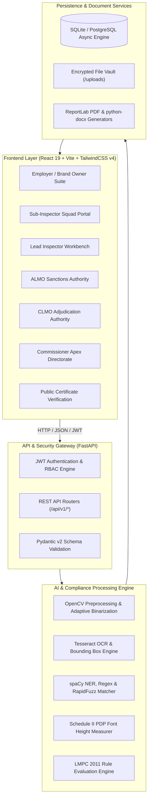
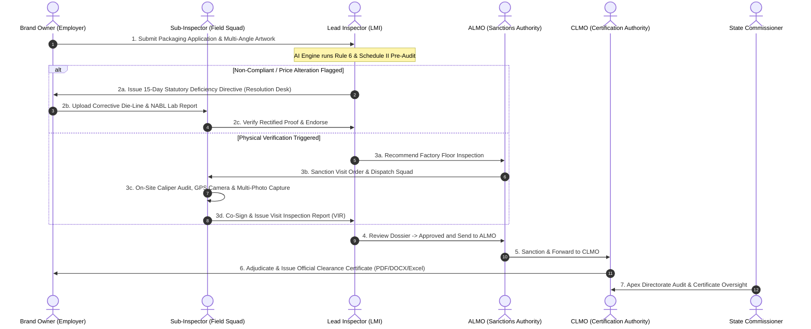
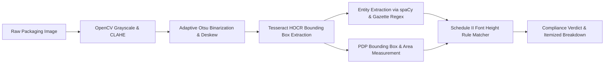
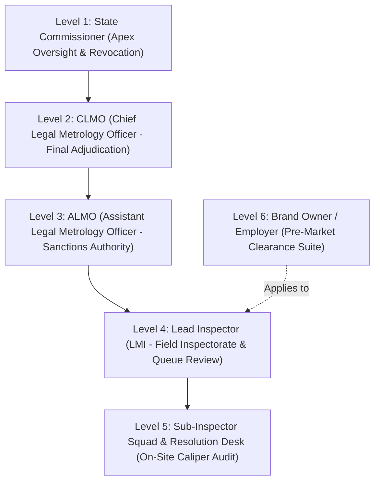
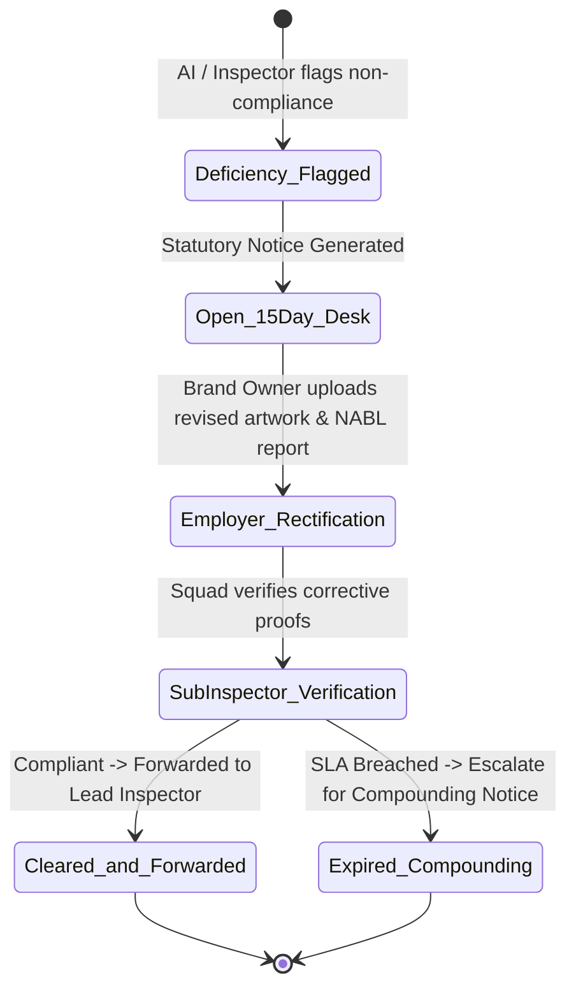

# 🇮🇳 Legal Metrology Packaged Commodities (LMPC) AI Compliance & Enforcement Platform

> **An Enterprise-Grade, End-to-End Digital Governance and Computer Vision Solution for Automated Statutory Compliance Verification under the Legal Metrology (Packaged Commodities) Rules, 2011.**

[](https://fastapi.tiangolo.com)
[](https://react.dev/)
[](https://tailwindcss.com/)
[](https://opencv.org)
[](https://github.com/tesseract-ocr/tesseract)
[](https://www.python.org)

---

## 🌟 Solution Overview & Complete End-to-End Flowchart

The **LMPC Compliance Platform** is an AI-powered, multi-tenant digital governance ecosystem that automates statutory label verification, eliminates human measurement subjectivity, detects fraudulent price alteration (Rule 11), and streamlines clearance across all Directorate tiers and brand owners.

### 🖼️ Solution Architecture & Workflow Infographic Figure


*Figure 1: Complete end-to-end architecture and operational lifecycle of the Legal Metrology (LMPC) AI Compliance Platform spanning Multi-Angle Packaging Input, Computer Vision & Schedule II Measurement Engine, 15-Day Statutory Resolution Desk, 4-Tier Directorate Adjudication, and Digital Certificate Vault.*

### 📊 Interactive Workflow Flowchart Diagram

```mermaid
flowchart TD
    %% Styling & Colors
    classDef inputStyle fill:#EFF6FF,stroke:#3B82F6,stroke-width:2px,color:#1E3A8A;
    classDef aiStyle fill:#FAF5FF,stroke:#9333EA,stroke-width:2px,color:#581C87;
    classDef reviewStyle fill:#FFFBEB,stroke:#D97706,stroke-width:2px,color:#78350F;
    classDef actionStyle fill:#ECFDF5,stroke:#059669,stroke-width:2px,color:#064E3B;
    classDef dangerStyle fill:#FEF2F2,stroke:#DC2626,stroke-width:2px,color:#7F1D1D;
    classDef vaultStyle fill:#F0FDF4,stroke:#16A34A,stroke-width:3px,color:#14532D;

    %% 1. Ingestion Layer
    subgraph INGEST["1. Multi-Channel Input & Packaging Ingestion"]
        A1["Brand Owner: Pre-Press Artwork Upload<br/>(Front PDP, Back PDP, Side Panels)"]:::inputStyle
        A2["Field Officer: On-Site Camera Capture<br/>(GPS Geo-Tagged & Watermarked)"]:::inputStyle
        A3["Citizen / General User: Label Scanner<br/>(Direct Image / Mobile Camera)"]:::inputStyle
    end

    %% 2. AI Processing Engine
    subgraph AI_PIPELINE["2. AI Vision & Statutory Rules Processing Engine"]
        B1["OpenCV Preprocessing & Adaptive CLAHE Binarization"]:::aiStyle
        B2["Tesseract HOCR Bounding Box & Text Extraction"]:::aiStyle
        B3["spaCy NLP Named Entity Recognition & Gazette Regex"]:::aiStyle
        B4["Schedule II PDP Surface Area & Numeral Height Metric Measurer"]:::aiStyle
        B5["Rule Evaluation Engine<br/>(Rules 6, 11, 27 & Schedule II)"]:::aiStyle
        
        B1 --> B2 --> B3 --> B5
        B1 --> B4 --> B5
    end

    INGEST --> B1

    %% 3. Compliance Decision Gate
    B5 --> DECISION{"Statutory Compliance<br/>Evaluation"}

    %% 4. Branch A: Violations & 15-Day Resolution Desk
    subgraph RESOLUTION_DESK["3A. 15-Day Statutory Deficiency & Resolution Desk"]
        C1["Statutory Breach Detected<br/>(Missing Declarations / Rule 11 Tampering / Sub-2.0mm Font)"]:::dangerStyle
        C2["15-Day Deficiency Directive Dispatched to Brand Owner"]:::dangerStyle
        C3["Brand Owner Uploads Corrective Die-Line & NABL Lab Report"]:::reviewStyle
        C4["Sub-Inspector Squad Verifies Corrected Proofs & Re-Audits"]:::reviewStyle
        
        C1 --> C2 --> C3 --> C4
    end

    %% 5. Branch B: Field Visit & On-Site Verification
    subgraph FIELD_VISIT["3B. Field Squad Dispatch & On-Site Verification"]
        D1["Physical Inspection Triggered (Rule 11 / Factory Audit)"]:::reviewStyle
        D2["ALMO Sanctions & Dispatches Sub-Inspector Squad"]:::reviewStyle
        D3["Sub-Inspector On-Site Inspection:<br/>• Live GPS Camera Multi-Photo Upload<br/>• Vernier Caliper Physical Numeral Measurement"]:::reviewStyle
        D4["Co-Signed Visit Inspection Report (VIR) with SHA-256 Digital Seal"]:::actionStyle
        
        D1 --> D2 --> D3 --> D4
    end

    DECISION -- "Deficiencies Flagged" --> C1
    DECISION -- "Physical Audit Mandated" --> D1
    DECISION -- "Statutory Compliant" --> E1

    C4 -- "Deficiency Rectified & Endorsed" --> E1
    D4 -- "VIR Co-Signed & Completed" --> E1

    %% 6. Directorate Tiered Adjudication Pipeline
    subgraph DIRECTORATE["4. 4-Tier Directorate Adjudication & Certification Pipeline"]
        E1["Level 4: Lead Inspector (LMI) Review & Endorsement<br/>• Approved & Send to ALMO<br/>• Reject & Re-Submit Sub-Inspector for Clarification"]:::actionStyle
        E2["Level 3: ALMO Sanctions Authority Review & Endorsement"]:::actionStyle
        E3["Level 2: CLMO Adjudication Authority Verification<br/>(100% Rules Verified & Final Grant)"]:::actionStyle
        E4["Level 1: State Commissioner Apex Directorate<br/>(Statewide Oversight & Revocation Controls)"]:::actionStyle
        
        E1 -->|Send to ALMO| E2 -->|Forward to CLMO| E3
        E3 -.->|Apex Oversight| E4
    end

    %% 7. Output Vault & Verification
    subgraph OUTPUT_VAULT["5. Digital Certificate Vault & Multi-Format Exports"]
        F1["Official Statutory Clearance Certificate (PDF)"]:::vaultStyle
        F2["Editable Legal Directorate Dossier (DOCX)"]:::vaultStyle
        F3["Quality Assurance & Audit Matrix (Excel XLSX)"]:::vaultStyle
        F4["Public QR Code Verification Portal<br/>(/verify/:cert_number)"]:::vaultStyle
    end

    E3 -->|Issue Sealed Certificate| OUTPUT_VAULT
```



---

## 📌 Table of Contents
1. [Solution Overview & Flowchart Diagram](#-solution-overview--complete-end-to-end-flowchart)
2. [Executive Summary & Problem Statement](#-executive-summary--problem-statement)
3. [Key Features & Capabilities](#-key-features--capabilities)
4. [System Architecture](#-system-architecture)
5. [Statutory Workflow & Governance Lifecycle](#-statutory-workflow--governance-lifecycle)
6. [Computer Vision, OCR & Font Measurement Engine](#-computer-vision-ocr--font-measurement-engine)
7. [Statutory Rules Matrix & Gazette Legal Checks](#-statutory-rules-matrix--gazette-legal-checks)
8. [6-Tier Role-Based Access Control (RBAC)](#-6-tier-role-based-access-control-rbac)
9. [Statutory Resolution Desk & 15-Day SLA Protocol](#-statutory-resolution-desk--15-day-sla-protocol)
10. [Reporting, Document Vault & Certificate Verification](#-reporting-document-vault--certificate-verification)
11. [REST API Directory](#-rest-api-directory)
12. [Installation & Quick Start Guide](#-installation--quick-start-guide)
13. [Default Demonstration Accounts](#-default-demonstration-accounts)

---

## 🏛️ Executive Summary & Problem Statement

In India, packaging and labeling of all pre-packaged commodities are strictly regulated under the **Legal Metrology Act, 2009** and the **Legal Metrology (Packaged Commodities) Rules, 2011 (LMPC)**. Non-compliance results in heavy compounding fees, product seizures, and criminal liability. 

### Key Challenges in Traditional Enforcement:
- **Manual & Subjective Inspection**: Field inspectors physically measure numeral character heights using mechanical calipers, causing human error and inconsistent enforcement.
- **Pre-Market Bottlenecks**: Brand owners wait weeks for manual pre-press artwork clearance before launching new packaging lines.
- **Price Alteration & Smudging Fraud (Rule 11)**: Deceptive secondary stickers, overwritten MRPs, and omitted tax declarations routinely escape manual detection.
- **Siloed Communication**: Lack of a centralized audit trail connecting the State Commissioner, District Officers (CLMO/ALMO), Field Inspectors, and Manufacturers.

### The Core Solution:
1. **Pre-Market Clearance Suite** for brand owners to upload pre-press die-lines and obtain instant AI compliance pre-audits.
2. **Field Enforcement & Squad Dispatch Suite** with geo-stamped evidence capture, digital caliper logging, and SHA-256 signed visit reports.
3. **Statutory 15-Day Deficiency Resolution Desk** providing companies a statutory cure window before punitive prosecution.
4. **Tiered Directorate Clearance** enabling multi-level adjudication from Field Inspector up to the State Commissioner.

---

## 🚀 Key Features & Capabilities

- [x] **Multi-Angle Image Upload & High-Res Scanning**: Supports simultaneous upload and inspection of multi-panel packaging (Front Principal Display Panel, Back PDP, Side nutritional panels).
- [x] **Automated Mandatory Declaration Extraction**: High-precision extraction of Commodity Name, Net Quantity, MRP, Manufacturing Date, Expiry Date, Consumer Care, and Manufacturer Address.
- [x] **Schedule II Numeral Font Height & Readability Analysis**: Calculates Principal Display Panel (PDP) surface area in $cm^2$ and validates numeral heights against statutory minimum thresholds ($\ge 1.0\text{ mm}$ up to $\ge 6.0\text{ mm}$).
- [x] **Rule 11 Price Smudging & Overwrite Detection**: Identifies dual stickers, altered prices, overwritten MRPs, and omitted *"Inclusive of all taxes"* clauses.
- [x] **Rule 6(1)(h) Unit Sale Price (USP) Validation**: Automatically computes mathematical correctness of price per gram, milliliter, or number.
- [x] **Rule 27 Manufacturer Undertaking Verification**: Cross-references corporate registration records and legal affidavits.
- [x] **On-Site Squad Camera & Evidence Geo-Tagging**: Live camera viewfinder with GPS watermarking, timestamp stamping, and multi-photo factory floor evidence upload.
- [x] **Digital Vernier Caliper Log**: Records physical tool calibration, model serial number, and physical measurements against AI estimates.
- [x] **Dedicated Full-Page Portals & Dossiers**: Tailored full-page audit dossiers for each authority tier with specific statutory action sets.
- [x] **Multi-Format Statutory Export**: 1-click export of Official Regulatory Clearance Certificates and Detailed Violation Inspection Reports (VIR) in **PDF**, **DOCX (Word)**, and **Excel (XLSX)**.
- [x] **Public QR Code Certificate Verification**: Dedicated verification endpoint (`/verify/:cert_number`) with cryptographic SHA-256 seal validation.

---

## 🏗️ System Architecture



---

## 🔄 Statutory Workflow & Governance Lifecycle



---

## 🔍 Computer Vision, OCR & Font Measurement Engine



### 1. Preprocessing Pipeline (`backend/app/pipeline/preprocessor.py`)
- **CLAHE (Contrast Limited Adaptive Histogram Equalization)**: Normalizes dynamic packaging gloss and glare.
- **Affine Deskewing**: Automatically rotates angled camera captures using minimum area rectangle detection.
- **Morphological Text Segmentation**: Isolates declaration clusters from decorative brand artwork.

### 2. Schedule II Font Height Metric Engine (`backend/app/engine/font_measurer.py`)
The system calculates the **Principal Display Panel (PDP)** surface area and enforces statutory numeral heights:

$$\text{PDP Area} = \text{Width (cm)} \times \text{Height (cm)}$$

| PDP Area ($A$) in $\text{cm}^2$ | Minimum Numeral Height (General) | Minimum Numeral Height (Blown/Molded) |
| :--- | :--- | :--- |
| $A \le 50$ | **$1.0\text{ mm}$** | **$2.0\text{ mm}$** |
| $50 < A \le 100$ | **$1.5\text{ mm}$** | **$3.0\text{ mm}$** |
| $100 < A \le 500$ | **$2.0\text{ mm}$** | **$4.0\text{ mm}$** |
| $500 < A \le 2500$ | **$4.0\text{ mm}$** | **$6.0\text{ mm}$** |
| $A > 2500$ | **$6.0\text{ mm}$** | **$6.0\text{ mm}$** |

---

## 📜 Statutory Rules Matrix & Gazette Legal Checks

| Gazette Rule | Regulatory Scope | Validation Logic & Severity |
| :--- | :--- | :--- |
| **Rule 6(1)(a)** | Generic / Common Commodity Name | Verifies identity declaration on Principal Display Panel (**CRITICAL**). |
| **Rule 6(1)(b)** | Name & Address of Manufacturer / Packer / Importer | Validates corporate identity, complete postal address with PIN code (**CRITICAL**). |
| **Rule 6(1)(c)** | Net Quantity Declaration | Validates standardized metric units ($\text{g, kg, ml, l, m, N}$) and prevents non-standard units (**CRITICAL**). |
| **Schedule II** | Minimum Font & Character Height | Compares detected bounding box heights against PDP Area table (**MAJOR**). |
| **Rule 6(1)(d)** | Maximum Retail Price (MRP) | Enforces ₹ currency symbol, decimal format, and mandatory *"Inclusive of all taxes"* clause (**CRITICAL**). |
| **Rule 11** | Price Alteration & Tampering | Flags dual price stickers, overwritten digits, or smudged markings (**CRITICAL**). |
| **Rule 6(1)(e)** | Date of Manufacture / Packaging | Validates `"MM/YYYY"` or `"Month Year"` format within statutory range (**MAJOR**). |
| **Rule 6(1)(f)** | Expiry / Best Before Declaration | Mandates date for perishable and consumable commodities (**MAJOR**). |
| **Rule 6(1)(g)** | Consumer Care Contact Details | Validates complete contact information (Designation, Address, Telephone, Email) (**MAJOR**). |
| **Rule 6(1)(h)** | Unit Sale Price (USP) | Checks arithmetic ratio of $\frac{\text{MRP}}{\text{Net Quantity}}$ when packaging exceeds statutory weight thresholds (**MODERATE**). |
| **Rule 27** | Registration of Manufacturers & Importers | Validates state LMPC registration license / undertaking (**CRITICAL**). |

---

## 👥 6-Tier Role-Based Access Control (RBAC)



1. **Level 1 — State Commissioner**: Statewide analytics, district enforcement metrics, ruleset customization, and statutory certificate revocation.
2. **Level 2 — CLMO (Chief Legal Metrology Officer)**: Adjudication gate verifying 100% statutory compliance and issuing official sealed clearance certificates.
3. **Level 3 — ALMO (Assistant Legal Metrology Officer)**: Sanctioning authority dispatching field visit orders and endorsing factory inspection reports.
4. **Level 4 — Lead Inspector (LMI)**: Reviews pre-market applications, triggers physical visit recommendations, and endorses dossiers with:
   - `Approved and Send to ALMO`
   - `Reject`
   - `Re-Submit Sub-Inspector for Clarification`
5. **Level 5 — Sub-Inspector Squad**: Conducts physical factory visits, logs GPS-watermarked camera photos, records Vernier caliper measurements, and adjudicates the 15-Day Resolution Desk.
6. **Level 6 — Employer / Brand Owner**: Pre-press die-line workbench, multi-panel upload, real-time application tracker, and certificate vault.

---

## ⚖️ Statutory Resolution Desk & 15-Day SLA Protocol



---

## 📄 Reporting, Document Vault & Certificate Verification

### Export Capabilities:
- **Official Statutory Clearance Certificate (PDF)**: High-resolution vector seal, Directorate header, dynamic QR code, and unique certificate identification (`LMPC-2026-CERT-XXXXX`).
- **Word Document Format (DOCX)**: Fully editable legal format for official Directorate record-keeping.
- **Audit Spreadsheet (XLSX)**: Itemized violation and character measurement log for corporate quality control teams.
- **Public Verification Endpoint**: Real-time validation at `/verify/{cert_number}` confirming issuance date, registered brand, commodity specifications, and cryptographic hash.

---

## 📡 REST API Directory

| Method | Endpoint | Access Level | Description |
| :--- | :--- | :--- | :--- |
| `POST` | `/api/v1/auth/login` | Public | Authenticates users and issues scoped JWT access token. |
| `POST` | `/api/v1/scan/upload` | Authorized | Executes OCR, font measurement, and rule evaluation on label image. |
| `GET` | `/api/v1/products/{id}` | Authorized | Universal dossier retrieval with multi-photo URLs and visit orders. |
| `POST` | `/api/v1/employer/pre-market-applications` | Employer | Submits pre-press packaging application for statutory review. |
| `POST` | `/api/v1/employer/upload-multiple-artwork` | Employer | Batch upload endpoint for multi-panel packaging proofs. |
| `GET` | `/api/v1/inspector/pre-market-applications` | Lead Inspector | Retrieves active pre-market queue for review and endorsement. |
| `POST` | `/api/v1/inspector/endorse-application/{id}` | Lead Inspector | Dispatches statutory action (`send_to_almo`, `reject`, `re_clarification`). |
| `GET` | `/api/v1/sub-inspector/field-visits` | Sub-Inspector | Retrieves assigned on-site inspection orders. |
| `POST` | `/api/v1/sub-inspector/log-evidence` | Sub-Inspector | Uploads GPS camera photos, caliper readings, and co-signed VIR. |
| `GET` | `/api/v1/sub-inspector/history` | Sub-Inspector | Chronological audit history of field visits and Resolution Desk cases. |
| `POST` | `/api/v1/supervisor/pre-market-decide/{id}` | CLMO / ALMO | Final adjudication and statutory certificate issuance. |
| `GET` | `/api/v1/reports/pre-market-certificate/{id}/pdf` | Authorized | Generates sealed Clearance Certificate PDF. |
| `GET` | `/api/v1/reports/public-verify/{cert_no}` | Public | Cryptographic certificate authenticity lookup. |

---

## 💻 Installation & Quick Start Guide

### Prerequisites
- **Python 3.11+**
- **Node.js 18+ & npm**
- **Tesseract OCR Engine** (Installed and added to system `PATH`)

---

### Step 1: Backend Setup
```bash
# Navigate to backend directory
cd backend

# Create virtual environment
python -m venv venv

# Activate virtual environment
# Windows:
venv\Scripts\activate
# Linux/macOS:
# source venv/bin/activate

# Install dependencies
pip install -r requirements.txt

# Download spaCy NLP model
python -m spacy download en_core_web_sm

# Start FastAPI server
python -m uvicorn app.main:app --port 8000 --host 0.0.0.0 --reload
```
API Documentation will be live at: `http://localhost:8000/docs`

---

### Step 2: Frontend Setup
```bash
# Open a new terminal and navigate to frontend directory
cd frontend

# Install node dependencies
npm install

# Start Vite development server
npm run dev
```
Web Application will be live at: `http://localhost:5173`

---

## 🔑 Default Demonstration Accounts

| Role | Username / Identifier | Password | Default Portal Route |
| :--- | :--- | :--- | :--- |
| **State Commissioner** | `commissioner_delhi` | `commissioner123` | `/commissioner` |
| **CLMO Supervisor** | `clmo.supervisor.lmpc@gmail.com` | `clmo123` | `/clmo` |
| **ALMO Sanctions Officer** | `almo_central` | `almo123` | `/almo` |
| **Lead Inspector (LMI)** | `INSP-DEL-042` | `inspector123` | `/inspector` |
| **Sub-Inspector Squad** | `ASST-DEL-012` | `subinspector123` | `/sub-inspector` |
| **Brand Owner (Employer)** | `employer_parle` | `employer123` | `/employer` |

---

## 📄 License & Statutory Notice

This prototype has been developed for the **Legal Metrology Department, Ministry of Consumer Affairs, Food and Public Distribution, Government of India**. All statutory rules and metrics are aligned with the Gazette of India notifications for the **Legal Metrology (Packaged Commodities) Rules, 2011**.
