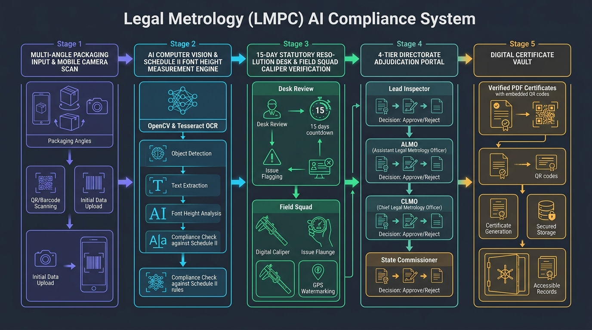
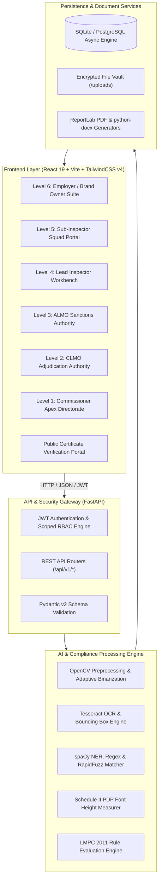
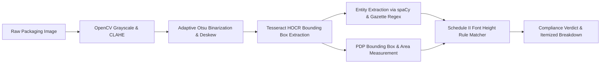
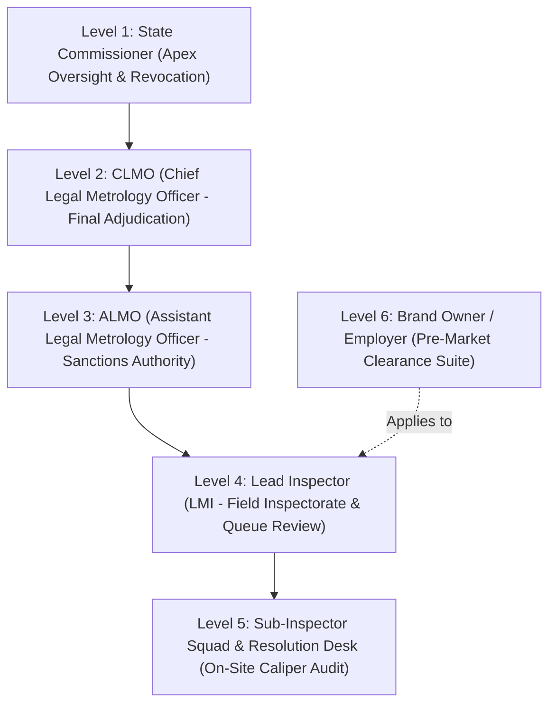
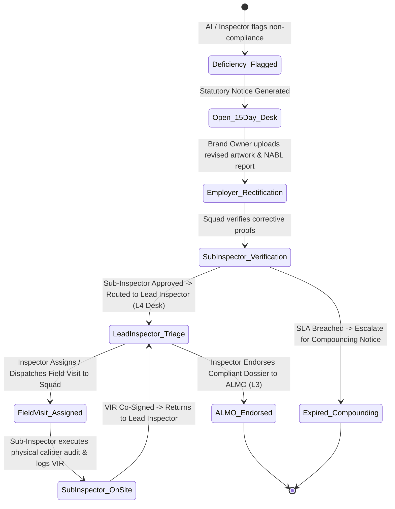

# 🇮🇳 Legal Metrology Packaged Commodities (LMPC) AI Compliance & Enforcement Platform
### 🏆 Smart India Hackathon (SIH 2026) • Problem Statement ID: 26034
> **Theme:** Agriculture, FoodTech & Rural Development / Consumer Protection  
> **Ministry / Department:** Department of Consumer Affairs (DoCA), Ministry of Consumer Affairs, Food and Public Distribution, Government of India  
> **Title:** Software System to check compliance of Packaged Commodities under Legal Metrology (Packaged Commodities) Rules, 2011 by scanning products, images and labels.

[](https://github.com/harshithps35/Legal-Metrology-Packaged-Commodities-LMPC-AI-Compliance-Enforcement-Platform/actions)
[](https://fastapi.tiangolo.com)
[](https://react.dev/)
[](https://tailwindcss.com/)
[](https://opencv.org)
[](https://github.com/tesseract-ocr/tesseract)
[](https://www.python.org)
[](./LICENSE)

> 💡 **India's first platform to codify LMPC Rules 2011 into a machine-readable rule engine with end-to-end SHA-256 audit trail and tamper-proof chain of custody.**

### 🎬 Live Demo

<video src="docs/demo.mp4" controls width="100%" poster="docs/solution_architecture.jpg">
  Your browser does not support the video tag. <a href="docs/demo.mp4">Download the demo video</a>.
</video>

*Working prototype with audio walkthrough — product label upload, automated OCR extraction, Rule Engine compliance analysis, and statutory violation report generation.*

---

### 📊 Quantified Impact

| Metric | Traditional Manual Inspection | LMPC AI Platform (PredictXY) | Impact |
|---|---|---|---|
| **Clearance Time** | 21 Days | **3 Days** | ⏱️ **85% faster** |
| **OCR Accuracy** | N/A (Manual) | **≥ 95% target** | 🎯 Multi-engine fallback |
| **Inspection Cost** | High administrative overhead | **~70% cost savings** | 💰 Automated pre-screening |
| **Paperwork** | Paper notices & dossiers | **~90% paper reduction** | 📄 QR & digital chain of custody |
| **Multilingual** | Hindi/English only (manual) | **English, Hindi + 8 regional scripts** | 🌐 Tesseract language packs |

> 🚀 **Scalability:** Cloud-native deployment on MeitY-empanelled providers; API-ready for integration with Dept. of Consumer Affairs' National Consumer Helpline (NCH) and existing state LMPC portals.

---

## 🌟 Solution Overview & Complete End-to-End Flowchart

The **LMPC Compliance Platform** is an enterprise-grade, end-to-end digital governance and computer vision platform. It replaces slow, error-prone manual caliper inspections with **automated AI label verification**, **Rule 11 price tampering detection**, **Schedule II font height calculations**, a **15-Day Statutory Resolution Desk**, and a **4-tier Directorate Adjudication Pipeline**.

### 🖼️ Solution Architecture & Workflow Infographic Figure



*Figure 1: High-level architectural flowchart of the Legal Metrology (LMPC) AI Compliance Platform illustrating the 5 sequential stages from multi-angle packaging ingestion, AI computer vision, 15-day resolution desk, 4-tier Directorate adjudication, to digital certificate issuance.*

---

### 📊 End-to-End System Workflow & Governance Lifecycle

```mermaid
flowchart TD
    %% Styling & Colors
    classDef inputStyle fill:#EFF6FF,stroke:#3B82F6,stroke-width:2px,color:#1E3A8A;
    classDef aiStyle fill:#FAF5FF,stroke:#9333EA,stroke-width:2px,color:#581C87;
    classDef reviewStyle fill:#FFFBEB,stroke:#D97706,stroke-width:2px,color:#78350F;
    classDef actionStyle fill:#ECFDF5,stroke:#059669,stroke-width:2px,color:#064E3B;
    classDef dangerStyle fill:#FEF2F2,stroke:#DC2626,stroke-width:2px,color:#7F1D1D;
    classDef vaultStyle fill:#F0FDF4,stroke:#16A34A,stroke-width:3px,color:#14532D;

    %% 1. Ingestion Layer
    subgraph INGEST["1. Multi-Channel Input & Packaging Ingestion"]
        A1["Brand Owner: Pre-Press Artwork Upload<br/>(Front PDP, Back PDP, Side Panels)"]:::inputStyle
        A2["Field Squad: On-Site Camera Capture<br/>(GPS Geo-Tagged & Watermarked)"]:::inputStyle
        A3["Citizen / Consumer: Label Scanner<br/>(Mobile Camera / Retail Capture)"]:::inputStyle
    end

    %% 2. AI Processing Engine
    subgraph AI_PIPELINE["2. AI Vision & Statutory Rules Processing Engine"]
        B1["OpenCV Preprocessing & Adaptive CLAHE Binarization"]:::aiStyle
        B2["Tesseract HOCR Bounding Box & Text Extraction"]:::aiStyle
        B3["spaCy NLP Named Entity Recognition & Gazette Legal Matchers"]:::aiStyle
        B4["Schedule II PDP Area & Numeral Height Metric Measurer"]:::aiStyle
        B5["Rule Evaluation Engine<br/>(Rules 6, 11, 27 & Schedule II)"]:::aiStyle
        
        B1 --> B2 --> B3 --> B5
        B1 --> B4 --> B5
    end

    INGEST --> B1

    %% 3. Compliance Decision Gate
    B5 --> DECISION{"Statutory Compliance<br/>Evaluation"}

    %% 4. Branch A: Violations & 15-Day Resolution Desk
    subgraph RESOLUTION_DESK["3A. 15-Day Statutory Deficiency & Resolution Desk"]
        C1["Statutory Breach Detected<br/>(Missing Declarations / Rule 11 Tampering / Sub-2.0mm Font)"]:::dangerStyle
        C2["15-Day Deficiency Directive Dispatched to Brand Owner"]:::dangerStyle
        C3["Brand Owner Uploads Corrective Die-Line & NABL Lab Report"]:::reviewStyle
        C4["Sub-Inspector Squad Verifies Corrected Proofs & Re-Audits"]:::reviewStyle
        
        C1 --> C2 --> C3 --> C4
    end

    %% 5. Branch B: Field Visit & On-Site Verification
    subgraph FIELD_VISIT["3B. Field Squad Dispatch & On-Site Verification"]
        D1["Physical Inspection Triggered (Rule 11 / Factory Audit)"]:::reviewStyle
        D2["ALMO Sanctions & Dispatches Sub-Inspector Squad"]:::reviewStyle
        D3["Sub-Inspector On-Site Inspection:<br/>• Live GPS Camera Multi-Photo Upload<br/>• Vernier Caliper Physical Numeral Measurement"]:::reviewStyle
        D4["Co-Signed Visit Inspection Report (VIR) with SHA-256 Digital Seal"]:::actionStyle
        
        D1 --> D2 --> D3 --> D4
    end

    DECISION -- "Deficiencies Flagged" --> C1
    DECISION -- "Physical Audit Mandated" --> D1
    DECISION -- "Statutory Compliant" --> E1

    C4 -- "Deficiency Rectified & Endorsed by Sub-Inspector" --> E1
    D4 -- "VIR Co-Signed & Completed by Sub-Inspector" --> E1

    %% 6. Directorate Tiered Adjudication Pipeline
    subgraph DIRECTORATE["4. 4-Tier Directorate Adjudication & Certification Pipeline"]
        E1["Level 4: Lead Inspector (LMI) Triage Desk<br/>• Dispatch / Assign Field Visit to Squad<br/>• Endorse to ALMO for Certificate Sanction<br/>• Send to 15-Day Resolution Desk"]:::actionStyle
        E2["Level 3: ALMO Sanctions Authority Review & Endorsement"]:::actionStyle
        E3["Level 2: CLMO Adjudication Authority Verification<br/>(100% Rules Verified & Final Grant)"]:::actionStyle
        E4["Level 1: State Commissioner Apex Directorate<br/>(Statewide Oversight & Revocation Controls)"]:::actionStyle
        
        E1 -->|Endorse to ALMO| E2 -->|Forward to CLMO| E3
        E1 -.->|Assign Field Visit| D1
        E3 -.->|Apex Oversight| E4
    end

    %% 7. Output Vault & Verification
    subgraph OUTPUT_VAULT["5. Digital Certificate Vault & Multi-Format Exports"]
        F1["Official Statutory Clearance Certificate (PDF)"]:::vaultStyle
        F2["Editable Legal Directorate Dossier (DOCX)"]:::vaultStyle
        F3["Quality Assurance & Audit Matrix (Excel XLSX)"]:::vaultStyle
        F4["Public QR Code Verification Portal<br/>(/verify/:cert_number)"]:::vaultStyle
    end

    E3 -->|Issue Sealed Certificate| OUTPUT_VAULT
```



---

## 📌 Table of Contents
1. [Solution Overview & Flowchart Diagram](#-solution-overview-complete-end-to-end-flowchart)
2. [Problem Statement & Regulatory Framework (LMPC 2011)](#-problem-statement-regulatory-framework-lmpc-2011)
3. [Key Capabilities in the Prototype](#-key-capabilities-in-the-prototype)
4. [Technical Approach & System Architecture](#-technical-approach-system-architecture)
5. [Computer Vision, OCR & Font Measurement Engine](#-computer-vision-ocr-font-measurement-engine)
6. [Statutory Rules Matrix & Gazette Legal Checks](#-statutory-rules-matrix-gazette-legal-checks)
7. [6-Tier Role-Based Access Control (RBAC) & Portals](#-6-tier-role-based-access-control-rbac-portals)
8. [Statutory Resolution Desk & 15-Day SLA Protocol](#-statutory-resolution-desk-15-day-sla-protocol)
9. [Reporting, Document Vault & Certificate Verification](#-reporting-document-vault-certificate-verification)
10. [REST API Directory](#-rest-api-directory)
11. [Installation & Quick Start Guide](#-installation-quick-start-guide)
12. [Default Demonstration Accounts](#-default-demonstration-accounts)

---

## 🏛️ Problem Statement & Regulatory Framework (LMPC 2011)

In India, packaging and labeling of all pre-packaged commodities are strictly governed under the **Legal Metrology Act, 2009** and the **Legal Metrology (Packaged Commodities) Rules, 2011 (LMPC)**. Non-compliance results in compounding fees, product seizures, and prosecution.

### Key Pain Points in Traditional Enforcement:
- **Subjective & Slow Caliper Measurements**: Field inspectors manually verify character heights using mechanical Vernier calipers on physical packaging, leading to measurement disputes and human error.
- **Pre-Market Clearance Delays**: Brand owners face prolonged manual review cycles before commercial packaging rollouts.
- **Deceptive Price Alterations (Rule 11)**: Secondary price stickers, smudged MRPs, and omitted tax declarations deceive consumers and evade retail surveillance.
- **Disconnected Field Data**: Lack of real-time GPS evidence capture and absence of an auditable digital trail connecting Field Officers, Sanctions Officers, and the State Directorate.

---

## 🚀 Key Capabilities in the Prototype

- [x] **Image Upload & Multi-Angle Product Scanning**: Batch upload of pre-press artwork die-lines (Front PDP, Back PDP, Side nutritional panels) and live camera photos.
- [x] **Extraction of Mandatory Declarations (Rule 6)**: High-accuracy extraction of Commodity Name, Net Quantity, MRP, Manufacturing Date, Expiry Date, Consumer Care Contact, and Manufacturer Address.
- [x] **Schedule II Font Size & Readability Analysis**: Calculates Principal Display Panel (PDP) surface area in $\text{cm}^2$ and validates numeral heights against statutory minimum thresholds ($1.0\text{ mm}$ to $6.0\text{ mm}$).
- [x] **Detection of Missing, Misleading, or Altered Declarations**: Automatically identifies dual price stickers, overwritten digits, missing *"inclusive of all taxes"*, and non-standard metric units.
- [x] **Rule 6(1)(h) Unit Sale Price (USP) Mathematical Check**: Enforces correct calculation of price per gram, milliliter, or number.
- [x] **Generation of Compliance/Non-Compliance Reports (VIR)**: Itemized, rule-by-rule statutory inspection reports with legal section references.
- [x] **Attachment of Photographs & Supporting Evidence**: Geo-tagged camera viewfinder with GPS watermarking, timestamping, Vernier caliper logs, and factory floor evidence galleries.
- [x] **Repository of Scanned Products & Audit History**: Chronological timeline of all pre-market submissions, field visit orders, and resolution cases.
- [x] **Role-Based User Access (RBAC)**: 6 dedicated portals for State Commissioner, CLMO, ALMO, Lead Inspector, Sub-Inspector Squad, and Employer/Brand Owner.
- [x] **Enforcement & Monitoring Dashboards**: Real-time KPI tracking for active visits, overdue 15-day notices, and certified commodities.
- [x] **Multi-Format Statutory Export**: 1-click export of Official Clearance Certificates and Inspection Reports to **PDF (with Vector Seal)**, **DOCX (Word)**, and **Excel (XLSX)**.
- [x] **Public QR Code Authenticity Verification**: Dedicated verification endpoint (`/verify/:cert_number`) with cryptographic SHA-256 seal validation.

---

## 🏗️ Technical Approach & System Architecture



---

## 🔍 Computer Vision, OCR & Font Measurement Engine



The prototype engine is architected around four core AI, computer vision, and statutory verification pillars:

### 1. Optical Character Recognition (OCR) (`backend/app/pipeline/ocr_engine.py`, `preprocessor.py`)
- **OpenCV Computer Vision Pipeline**: Applies **CLAHE** (Contrast Limited Adaptive Histogram Equalization) to neutralize packaging glare on metallic/glossy foil packets, affine de-skewing for handheld camera captures, and morphological binarization.
- **Multi-Engine OCR Engine**: Uses **Tesseract OCR with HOCR/TSV coordinate extraction** alongside **EasyOCR** multi-pass text detection to accurately transcribe mandatory declarations (MRP, Net Quantity, Mfg/Exp Dates, FSSAI numbers, manufacturer postal addresses, and consumer helpline emails).

### 2. Object Detection & Bounding Boxes (`backend/app/engine/font_measurer.py`, `backend/app/nlp/ner_extractor.py`)
- **Bounding Box Localization**: Identifies precise pixel coordinates $(x, y, w, h)$ for individual text clusters and statutory labels across the Principal Display Panel (PDP).
- **Schedule II Character Height Metric Conversion**: Converts detected bounding box pixel heights into physical millimeters based on image DPI calibration:
  $$H_{\text{mm}} = \frac{\text{bbox\_height\_px}}{\text{DPI}} \times 25.4$$
- **Dual-Pricing & Sticker Overprint Detection**: Identifies secondary price alteration stickers pasted over original factory MRPs to flag Rule 11(2)(c) and Section 36 tampering offenses.

$$\text{PDP Area} = \text{Width (cm)} \times \text{Height (cm)}$$

| PDP Area ($A$) in $\text{cm}^2$ | Minimum Numeral Height (General) | Minimum Numeral Height (Blown/Molded) |
| :--- | :--- | :--- |
| $A \le 50$ | **$1.0\text{ mm}$** | **$2.0\text{ mm}$** |
| $50 < A \le 100$ | **$1.5\text{ mm}$** | **$3.0\text{ mm}$** |
| $100 < A \le 500$ | **$2.0\text{ mm}$** | **$4.0\text{ mm}$** |
| $500 < A \le 2500$ | **$4.0\text{ mm}$** | **$6.0\text{ mm}$** |
| $A > 2500$ | **$6.0\text{ mm}$** | **$6.0\text{ mm}$** |

### 3. Barcode & QR Scanning Libraries (`backend/app/pipeline/barcode_detector.py`)
- **1D & 2D Barcode Decoding**: Integrates `pyzbar` and OpenCV `QRCodeDetector` supporting **EAN-13**, **UPC-A**, **Code-128**, **DataMatrix**, and **QR Codes** for instantaneous GTIN product identification.
- **Dynamic Certificate Verification**: Mobile camera scanner decodes issued Directorate clearance certificate QR codes pointing to live verification dossiers at `/verify/:cert_number`.

### 4. Custom Statutory Rule Engine (`backend/app/engine/rule_engine.py`, `backend/app/rules/rules_lmpc.json`)
- **Rule Verification Core**: Ingests extracted NLP entities and coordinates, testing them against codified Gazette legal checks under the **Legal Metrology (Packaged Commodities) Rules, 2011**.
- **Automated Defect & Compounding Calculation**: Evaluates mandatory declarations (Rules 6(1)(a)-(h)), missing tax clauses, sub-threshold character heights (Schedule II), Section 36 tampering offenses, and Rule 27 registrations.

---

## 📜 Statutory Rules Matrix & Gazette Legal Checks

| Gazette Rule | Regulatory Scope | Validation Logic & Severity |
| :--- | :--- | :--- |
| **Rule 6(1)(a)** | Generic / Common Commodity Name | Verifies identity declaration on Principal Display Panel (**CRITICAL**). |
| **Rule 6(1)(b)** | Name & Address of Manufacturer / Packer / Importer | Validates corporate identity, complete postal address with PIN code (**CRITICAL**). |
| **Rule 6(1)(c)** | Net Quantity Declaration | Validates standardized metric units ($\text{g, kg, ml, l, m, N}$) and prevents non-standard units (**CRITICAL**). |
| **Schedule II** | Minimum Font & Character Height | Compares detected bounding box heights against PDP Area table (**MAJOR**). |
| **Rule 6(1)(d)** | Maximum Retail Price (MRP) | Enforces ₹ currency symbol, decimal format, and mandatory *"Inclusive of all taxes"* clause (**CRITICAL**). |
| **Rule 11** | Price Alteration & Tampering | Flags dual price stickers, overwritten digits, or smudged markings (**CRITICAL**). |
| **Rule 6(1)(e)** | Date of Manufacture / Packaging | Validates `"MM/YYYY"` or `"Month Year"` format within statutory range (**MAJOR**). |
| **Rule 6(1)(f)** | Expiry / Best Before Declaration | Mandates date for perishable and consumable commodities (**MAJOR**). |
| **Rule 6(1)(g)** | Consumer Care Contact Details | Validates complete contact information (Designation, Address, Telephone, Email) (**MAJOR**). |
| **Rule 6(1)(h)** | Unit Sale Price (USP) | Checks arithmetic ratio of $\frac{\text{MRP}}{\text{Net Quantity}}$ when packaging exceeds statutory weight thresholds (**MODERATE**). |
| **Rule 27** | Registration of Manufacturers & Importers | Validates state LMPC registration license / undertaking (**CRITICAL**). |

---

## 👥 6-Tier Role-Based Access Control (RBAC) & Portals



Each authority level is equipped with a **dedicated full-page portal and dossier route**:

1. **Level 1 — State Commissioner (`/commissioner`)**: Statewide compliance analytics, ruleset customization, and statutory certificate revocation controls.
2. **Level 2 — CLMO (`/clmo`)**: Adjudication gate verifying 100% statutory rule satisfaction and granting official clearance certificates (`Issue Certificate`, `Reject`, `Re Clarification`).
3. **Level 3 — ALMO (`/almo`)**: Sanctions authority dispatching field visit orders and endorsing inspection findings (`Sanction & Forward to CLMO`, `Reject`, `Re Clarification`).
4. **Level 4 — Lead Inspector (`/inspector`)**: Pre-Market Verification & Severity Gate (`L4 TRIAGE DESK`) review queue with dedicated gateways:
   - **`Dispatch / Assign Field Visit Order`** (Direct assignment to Sub-Inspector squad with facility name, suggested schedule, address, and statutory grounds)
   - **`Endorse to ALMO`** (Forward endorsed compliant dossier to ALMO Level 3 for statutory report sanction)
   - **`Send to Violations Desk (Require Docs)`** (Dispatches mandatory document demand notice with 15-day cure window)
   - **`Route to 15-Day Statutory Resolution Desk`** (Dispatches formal deficiency memo to Brand Owner)
   - **`Defect Notice / Revision Request`**
5. **Level 5 — Sub-Inspector Squad & Resolution Desk (`/sub-inspector`)**: Executes on-site factory visits, captures GPS-watermarked camera photos, logs digital Vernier caliper readings, and verifies 15-Day Resolution Desk submissions (`Approve & Submit to Lead Inspector`, `Reject & Demand Clarification`, `Escalate to ALMO`).
6. **Level 6 — Brand Owner / Employer (`/employer`)**: Multi-angle pre-press artwork workbench, live application status tracking, notice rectification desk, and certificate download vault.

---

## ⚖️ Statutory Resolution Desk & 15-Day SLA Protocol



---

## 📄 Reporting, Document Vault & Certificate Verification

- **Official Statutory Clearance Certificate (PDF)**: High-resolution vector seal, Directorate header, dynamic QR code, and unique certificate identification (`LMPC-2026-CERT-XXXXX`).
- **Word Document Format (DOCX)**: Fully editable legal format for official Directorate record-keeping.
- **Audit Spreadsheet (XLSX)**: Itemized violation and character measurement log for corporate quality control teams.
- **Public Verification Endpoint**: Real-time validation at `/verify/{cert_number}` confirming issuance date, registered brand, commodity specifications, and cryptographic hash.

---

## 📡 REST API Directory

| Method | Endpoint | Access Level | Description |
| :--- | :--- | :--- | :--- |
| `POST` | `/api/v1/auth/login` | Public | Authenticates users and issues scoped JWT access token. |
| `POST` | `/api/v1/scan/upload` | Authorized | Executes OCR, font measurement, and rule evaluation on label image. |
| `GET` | `/api/v1/products/{id}` | Authorized | Universal dossier retrieval with multi-photo URLs and visit orders. |
| `POST` | `/api/v1/employer/pre-market-applications` | Employer | Submits pre-press packaging application for statutory review. |
| `POST` | `/api/v1/employer/upload-multiple-artwork` | Employer | Batch upload endpoint for multi-panel packaging proofs. |
| `GET` | `/api/v1/inspector/pre-market-applications` | Lead Inspector | Retrieves active pre-market queue for review and endorsement. |
| `POST` | `/api/v1/inspector/endorse-application/{id}` | Lead Inspector | Dispatches statutory action (`send_to_almo`, `reject`, `re_clarification`). |
| `GET` | `/api/v1/sub-inspector/field-visits` | Sub-Inspector | Retrieves assigned on-site inspection orders. |
| `POST` | `/api/v1/sub-inspector/log-evidence` | Sub-Inspector | Uploads GPS camera photos, caliper readings, and co-signed VIR. |
| `GET` | `/api/v1/sub-inspector/history` | Sub-Inspector | Chronological audit history of field visits and Resolution Desk cases. |
| `POST` | `/api/v1/supervisor/pre-market-decide/{id}` | CLMO / ALMO | Final adjudication and statutory certificate issuance. |
| `GET` | `/api/v1/reports/pre-market-certificate/{id}/pdf` | Authorized | Generates sealed Clearance Certificate PDF. |
| `GET` | `/api/v1/reports/public-verify/{cert_no}` | Public | Cryptographic certificate authenticity lookup. |

---

## 💻 Installation & Quick Start Guide

### Prerequisites
- **Python 3.11+**
- **Node.js 18+ & npm**
- **Tesseract OCR Engine** (Installed and added to system `PATH`)

---

### Step 1: Backend Setup
```bash
# Navigate to backend directory
cd backend

# Create virtual environment
python -m venv venv

# Activate virtual environment
# Windows:
venv\Scripts\activate
# Linux/macOS:
# source venv/bin/activate

# Install dependencies
pip install -r requirements.txt

# Download spaCy NLP model
python -m spacy download en_core_web_sm

# Start FastAPI server
python -m uvicorn app.main:app --port 8000 --host 0.0.0.0 --reload
```
API Documentation will be live at: `http://localhost:8000/docs`

---

### Step 2: Frontend Setup
```bash
# Open a new terminal and navigate to frontend directory
cd frontend

# Install node dependencies
npm install

# Start Vite development server
npm run dev
```
Web Application will be live at: `http://localhost:5173`

---

## 🔑 Default Demonstration Accounts

| Role | Username / Identifier | Password | Default Portal Route |
| :--- | :--- | :--- | :--- |
| **State Commissioner** | `commissioner_delhi` | `commissioner123` | `/commissioner` |
| **CLMO Supervisor** | `clmo.supervisor.lmpc@gmail.com` | `clmo123` | `/clmo` |
| **ALMO Sanctions Officer** | `almo_central` | `almo123` | `/almo` |
| **Lead Inspector (LMI)** | `INSP-DEL-042` | `inspector123` | `/inspector` |
| **Sub-Inspector Squad** | `ASST-DEL-012` | `subinspector123` | `/sub-inspector` |
| **Brand Owner (Employer)** | `employer_parle` | `employer123` | `/employer` |

---

## 📄 License & Statutory Notice

This project is licensed under the [MIT License](./LICENSE).

This prototype has been developed for the **Legal Metrology Department, Ministry of Consumer Affairs, Food and Public Distribution, Government of India** under Smart India Hackathon (SIH 2026) Problem Statement 26034. All statutory rules and metrics are aligned with the Gazette of India notifications for the **Legal Metrology (Packaged Commodities) Rules, 2011**.

---

## 📚 Documentation

- [System Architecture](docs/architecture.md) — Multi-tier governance, security, and database schema
- [REST API Reference](docs/api-reference.md) — Complete endpoint catalog with request/response examples
- [Rule Engine Specification](docs/rule-engine.md) — Codified LMPC 2011 rules with severity taxonomy

---

**Team PredictXY** • Smart India Hackathon 2026 • Problem Statement 26034
