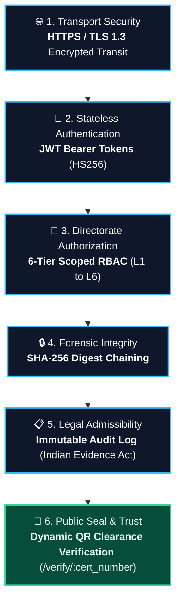
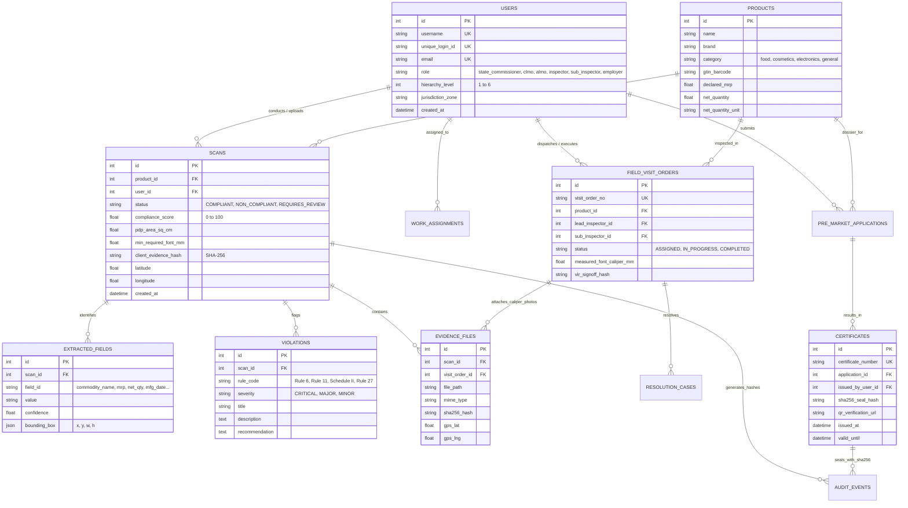

# System Architecture — LMPC AI Compliance & Enforcement Platform

## Overview

The LMPC Compliance Platform is a multi-tier, role-segregated digital governance system built to automate statutory label verification under the **Legal Metrology (Packaged Commodities) Rules, 2011**. The architecture enforces strict separation of concerns across 6 governance tiers, ensuring no single authority can self-sanction clearances.

---

## High-Level Architecture Diagram

```
┌──────────────────────────────────────────────────────────────────────┐
│                     FRONTEND (React 19 + Vite)                       │
│  ┌──────────┐ ┌──────────┐ ┌──────────┐ ┌──────────┐ ┌──────────┐  │
│  │ Consumer  │ │ Employer │ │   Sub-   │ │   Lead   │ │ ALMO /   │  │
│  │ Portal    │ │ Portal   │ │Inspector │ │Inspector │ │ CLMO     │  │
│  └────┬─────┘ └────┬─────┘ └────┬─────┘ └────┬─────┘ └────┬─────┘  │
│       └────────────┬┴───────────┬┴────────────┬┴───────────┘        │
│                    │  JWT Auth  │  REST API   │                      │
└────────────────────┼────────────┼─────────────┼──────────────────────┘
                     │            │             │
┌────────────────────┼────────────┼─────────────┼──────────────────────┐
│                   BACKEND (FastAPI + Pydantic v2)                    │
│  ┌──────────────────────────────────────────────────────────────┐   │
│  │                    API Gateway & JWT RBAC                     │   │
│  ├──────────┬──────────┬──────────┬──────────┬─────────────────┤   │
│  │ Auth     │ Products │  Scan &  │  Field   │  Reports &      │   │
│  │ Routes   │ Routes   │  OCR     │  Visits  │  Certificates   │   │
│  └──────────┴──────────┴────┬─────┴──────────┴─────────────────┘   │
│                              │                                       │
│  ┌───────────────────────────┼──────────────────────────────────┐   │
│  │              AI & COMPLIANCE ENGINE                           │   │
│  │  ┌──────────┐ ┌──────────┐ ┌──────────┐ ┌────────────────┐  │   │
│  │  │ OpenCV   │ │Tesseract │ │ spaCy    │ │  LMPC Rule     │  │   │
│  │  │ CLAHE +  │→│ HOCR +   │→│ NER +    │→│  Engine        │  │   │
│  │  │ Deskew   │ │ EasyOCR  │ │ Matchers │ │  (Rules 6,11,  │  │   │
│  │  │          │ │          │ │          │ │  27, Sched. II) │  │   │
│  │  └──────────┘ └──────────┘ └──────────┘ └────────────────┘  │   │
│  └──────────────────────────────────────────────────────────────┘   │
│                                                                       │
│  ┌──────────────────────────────────────────────────────────────┐   │
│  │                   PERSISTENCE LAYER                           │   │
│  │  SQLite / PostgreSQL  │  File Storage (uploads/)              │   │
│  │  ReportLab PDF Gen    │  python-docx DOCX Gen                 │   │
│  └──────────────────────────────────────────────────────────────┘   │
└───────────────────────────────────────────────────────────────────────┘
```

---

## 6-Tier Governance Hierarchy

| Tier | Role | Authority | Portal |
|------|------|-----------|--------|
| **L6** | State Commissioner | Apex oversight, statewide revocations | `/commissioner` |
| **L5** | CLMO (Chief Legal Metrology Officer) | Final adjudication, certificate issuance | `/clmo` |
| **L4** | ALMO (Asst. Legal Metrology Officer) | Visit sanctioning, endorsements | `/almo` |
| **L3** | Lead Inspector (LMI) | Triage desk, field visit dispatch | `/inspector` |
| **L2** | Sub-Inspector Squad | On-site inspections, VIR logging | `/sub-inspector` |
| **L1** | Brand Owner / Employer | Pre-market submissions, rectifications | `/employer` |

---

## SHA-256 Chain of Custody

Every state transition in the compliance lifecycle generates an immutable **SHA-256 hash** of the action payload (actor, timestamp, evidence, verdict). This creates a tamper-proof digital chain of custody from initial submission through to final certificate issuance.

```
Hash(n) = SHA-256( Hash(n-1) || action_payload || timestamp || actor_id )
```

This enables:
- **Forensic auditability** of every decision in the compliance pipeline.
- **Tamper detection** — any modification to intermediate records breaks the hash chain.
- **Legal admissibility** — digitally sealed evidence meets Indian Evidence Act requirements.

### 🛡️ End-to-End Cryptographic Security Pipeline



---

## Security Architecture

| Layer | Implementation |
|-------|----------------|
| **Authentication** | JWT tokens (HS256), session-based refresh |
| **Authorization** | Role-based access control (RBAC) with 6 tiers |
| **Encryption at Rest** | AES-256 for sensitive database fields |
| **Encryption in Transit** | TLS 1.3 (HTTPS) |
| **File Upload Security** | MIME type validation, size limits, sandboxed storage |
| **Audit Logging** | SHA-256 chained event log for all state transitions |

---

## Database Schema & Entity-Relationship (ER) Model

The database enforces referential integrity across users, products, automated OCR scans, statutory violations, field visits, and digitally sealed certificates:


